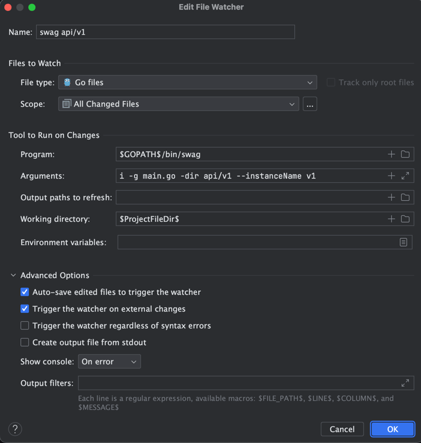

[](https://github.com/bridgewwater/gin-api-swagger-temple/actions?query=workflow%3Agolang-full)

## for what

- this project used to gin api server
- [ ] rename `github.com/bridgewwater/gin-api-swagger-temple` to your api package name

## evn

- minimum go version: go 1.18

### libs

| lib                                               | version    |
|:--------------------------------------------------|:-----------|
| https://github.com/gin-gonic/gin                  | v1.9.1     |
| https://github.com/swaggo/swag                    | v2.0.0-rc3 |
| https://github.com/swaggo/gin-swagger             | v1.6.0     |
| https://github.com/spf13/pflag                    | v1.0.5     |
| https://github.com/spf13/viper                    | v1.16.0    |
| https://github.com/json-iterator/go               | v1.1.12    |
| https://github.com/bar-counter/slog               | v1.1.0     |
| https://github.com/bar-counter/monitor            | v2.1.0     | 
| https://github.com/bar-counter/gin-correlation-id | v1.1.0     | 

## run

> if you want auto get local IP for fast develop, you can add evn `ENV_WEB_AUTO_HOST=true`

- each new swagger must rebuild swagger doc by task `make swagger`
- also use task `make dev` or `make run` also run task buildSwagger before.
- swagger tools use [swag](https://github.com/swaggo/swag)

```bash
$ go install github.com/swaggo/swag/v2/cmd/swag@v2.0.0-rc3
# this will install at: echo $(go env GOBIN)/bin
# this path must in your $PATH
```

- swagger doc format
  see [https://github.com/swaggo/swag#declarative-comments-format](https://github.com/swaggo/swag#declarative-comments-format)
- swagger example
  see [https://github.com/swaggo/swag/blob/master/example/basic/api/api.go](https://github.com/swaggo/swag/blob/master/example/basic/api/api.go)

### makefile usage

- `need go mod to management golang dependenceis`

```sh
$ make help
# check base dep
$ make init
# first run just use
$ make dep
# change conf/config.yaml

# run server as dev
$ make dev
# run as docker container
$ make dockerRunLinux
# if use macOS
$ make dockerRunDarwin
# stop or remove docker
$ make dockerStop
$ make dockerRemove
```

most of doc at [http://127.0.0.1:39000/swagger/index.html](http://127.0.0.1:39000/swagger/index.html)

## config

- config file is `config.yaml` demo see [conf/config.yaml](conf/config.yaml)

### log

- use log as: [http://github.com/bar-counter/slog](http://github.com/bar-counter/slog)

```yaml
log:
  writers: file,stdout            # file,stdout。`file` will let `logger_file` to file，`stdout` will show at std, most of time use bose
  logger_level: DEBUG             # log level: DEBUG, INFO, WARN, ERROR, FATAL
  logger_file: log/server.log     # log file setting
  log_format_text: false          # format `false` will format json, `true` will show abs
  rolling_policy: size            # rotate policy, can choose as: daily, size. `daily` store as daily，`size` will save as max
  log_rotate_date: 1              # rotate date, coordinate `rollingPolicy: daily`
  log_rotate_size: 8              # rotate size，coordinate `rollingPolicy: size`
  log_backup_count: 7             # backup max count, log system will compress the log file when log reaches rotate set, this set is max file count
```

## folder-structure

Project file definition

```
.
├── Dockerfile                  # ci build
├── Dockerfile.s6               # local docker build
├── z-MakefileUtils             # Makefile tool library
├── Makefile                    # Makefile file, using make as a compilation tool
├── README.md
├── api
│   ├── middleware              # api middleware directory
│   │   ├── app_version.go      # app version tracking middleware, use package.json to manage api version, header: X-App-Version
│   │   ├── header.go           # header middleware, include: options secure noCache etc.
│   │   ├── monitor.go          # monitor middleware, use https://github.com/bar-counter/monitor
│   │   └── usage.go            # usage middleware for Gin engine.
│   │
│   │                           # Each major version of api will be distinguished here, so in this directory, there will be multiple implementations of the same function.
│   └── v1                      # api /v1 directory
│       ├── main.go             # 
│       ├── auth                # under api/v1 auth api, The authentication method of each major version is inconsistent.
│       ├── errdef              # under api/v1 err define api, The error code of each major version is inconsistent.
│       ├── handler             # under api/v1 api, Similar to C in MVC architecture, it is used to read input, forward the processing flow to the actual processing function, and finally return the result.
│       │   ├── biz             # api group folder for /biz
│       │   ├── json.go         # json parse
│       │   └── jsonResponse.go # universal response structure, The authentication method of each major version is inconsistent.
│       └── main.go             # swag generated file entrance, swag base info update here
├── conf                        # Configuration files are stored in a unified directory
│   ├── config.yaml
│   ├── release                 # release configuration file
│   └── test                    # test configuration file
├── config                      # Dedicated to handling configuration and configuration files Go package
│   ├── baseConf.go
│   ├── config.go
│   ├── logConf.go
│   └── watchConf.go
├── build                       # build directory, which is not in the git list
├── dist                        # Publish the directory, which is not in the git list
├── doc                         # API document directory
│   ├── README.md
│   ├── monitor.md
│   ├── supervisor.md
│   └── systemctl.md
├── docker-compose.yml
├── docs                        # swagger build directory, which is generated by cli swag
│   ├── docs.go
│   ├── swagger.json
│   └── swagger.yaml
├── go.mod
├── logs                        # log directory not in git management list
├── main.go                     # app program entrance
├── pkg                         # referenced package
│   └── pkgJson
└── util                        # tool directory
    ├── folder
    ├── parsehttp
    └── sys
```

## development skills

### goland auto generate swagger doc

- open `Settings` -> `Tools` -> `File Watchers` -> `+` -> `Custom`
- new `File Watcher` as `swag api/v1`
  - Files to Watch 
    - name `swag api/v1`
    - file type `Go files`
    - scope `Project Files`
  - Tools to Run on Changes
    - Program `$GOPATH$/bin/swag`
    - Arguments `i -g main.go -dir api/v1 --instanceName v1`
    - Working directory `$ProjectFileDir$`

- 
